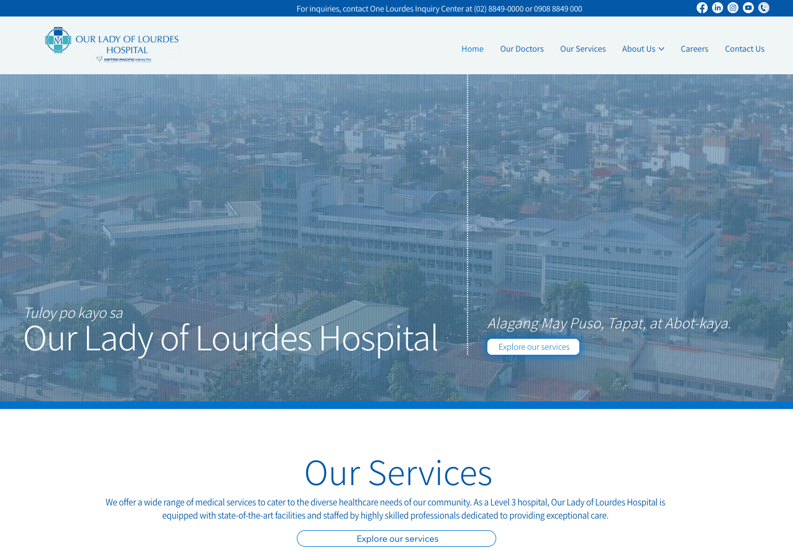

  

I built the doctor directory, did some audits & fixed a few bugs, mostly Wix-related.

  

  

<!-- other-work-footer -->

Feel free to browse my other public projects on my repos and website

  

  

